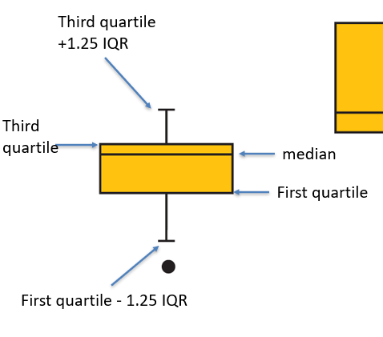
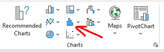
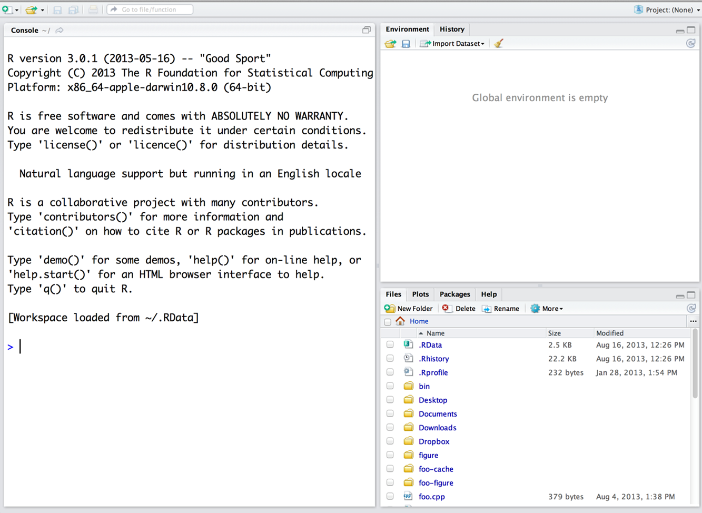

# Part 1:

## In Class Wednesday Assignment

::: callout-note
This is the assignment we worked on during Wednesday. If you completed it, you can move to section 2.
:::

Open the systolic blood pressure datafile.

Calculate the following:

1.  Mean (using the `=AVERAGE()` function in Excel). To use this function, select one cell in your document and type =AVERAGE() then select all of the observations.\
    More information on how to use this function is found here: <https://support.microsoft.com/en-us/office/average-function-047bac88-d466-426c-a32b-8f33eb960cf6>
2.  Find the median, first, and third quartiles. DO NOT USE FUNCTIONS FOR THIS.
3.  Obtain the Interquartile range
4.  Obtain the variance and standard deviations. **DO NOT USE FUNCTIONS. READ THE INSTRUCTIONS**

------------------------------------------------------------------------

To estimate the variance, do the following:

1.  Obtain the deviations $deviations = y_i - \hat{y}$
2.  Obtain the square of the deviations using the following: `^2`
3.  Obtain the sum of the squared deviations using the `=SUM()` function
4.  Divide the sum by n-1
5.  Congrats 🎆you have the variance
6.  Let's standardize it. Obtain the square root (`=SQRT()`) and that is the standard error.

Please keep a copy of the file. We will use it again next week.

# Part 2

## Plotting

In a piece of paper, draw a boxplot of the systolic blood pressure data.

Check the powerpoint, or this figure:



Now, let's do a histogram in Excel.

1.  Select all of the systolic data
2.  Go to insert
3.  Select the following:



And select histogram.

### Submit it!

Upload your excel file. and a picture of your plot

# Part 3

# Program R

This will be our first introduction to program R.

Please READ and follow ALL OF THE INSTRUCTIONS

## Install R and RStudio

### Install R

R can be downloaded from the following page <https://cran.r-project.org/>, follow the instructions to download it.

#### Windows

To install R on Windows, click the “Download R for Windows” link. Then click the “base” link. Next, click the first link at the top of the new page.

#### Mac

To install R in a Mac the “Download R for Mac” link. Next, click on the `R-4.4.2` package link.

#### Chromebooks or Ipads

Chromebooks and Ipads don’t allow you to install R or the RStudio program. However, there is an online platform that will allow you to run RStudio. If you go to <https://posit.cloud> , you should be able to create an account, and in your workspace you can open a new RStudio project. Your window will look the same as what we are working with, though there may be some quirks to getting

### Install RStudio

Go to <https://posit.co/download/rstudio-desktop/>

Click on the Download RStudio Desktop link. If you are using a Mac, you will need to scroll down a bit to see the download link.

## Explore R and RStudio

RStudio is a program, not different than Word. It works as a "wrapper" or "editor". You will write the code in RStudio, and it will run it in program R. You will *rarely* or maybe **never** open program R. You will do everything from RStudio!

::: callout-tip
RStudio needs R to function, so you need to download both programs!
:::

After you open RStudio, this is what you will see:



Now, you can code in R!

### Let's check R and RStudio!

Let's do a couple of things in R. Run the following lines (or similar, you can use different numbers!) on the **Console** (big screen on the left!)

First, let's do basic math:
```{r}
 5+5 
10*7
89-5
90/3

```


As you can see, we can use R as a calculator

Now, let's create a vector

```{r}
1:10
```

```{r}
120:170
```


::: callout-warning
# Try it! ✏️

Now, try to create a vector from 200 to 300
:::

Finally, let's roll a die!

We will roll a "D20" die (this is a die with 20 sides). First, we need to create this die. We can create objects in r using the following symbol: `<-` . Objects will save data, and we can use the object name to extract the data. We can create our dice using the following:

$$ \underbrace{D20}_{Object\; name} \; \; \; \underbrace{<-}_{arrow} \; \; \underbrace{1:20}_{Data} $$

The arrow is created with these two symbols: `<` and `-` .

```{r}
D20<-1:20
```


Now, if you do the following:
```{r}
D20
```


You extract the data from the object. Pretty cool!

Now, let's roll our die!

```{r}
sample(x=D20, size=1)
```

```{r}
sample(x=D20, size=1)
```

Let's now roll 3 D20 dice:

```{r} 
sample(x=D20, size=3, replace=TRUE)
```


::: callout-warning
## Think about it! 🧠

What do you think the `replace=TRUE` does?
:::

## Create a Project

Go to File \> New Project and create a new project called AGNR220. This is where you will download ALL files related to R assignments.

Make sure you know WHERE you created this project.

### Download the data

The following data are from Mattison et al. (2012), who carried out an experiment with rhesus monkeys to test whether a reduction in food intake extends life span (as measured in years). The data are the life spans of 19 male and 15 female monkeys who were randomly assigned a normal nutritious diet or a similar diet reduced in amount by 30%. All monkeys were adults at the start of the study.

Download the `datafood.csv` file and save it **IN THE SAME FOLDER AS YOUR PROJECT.**

To read the file into R, do the following:

```{r}
data<-read.csv("datafood.csv")
```

::: callout-warning
## Help! I can't import the data!

This can be pretty challenging. Make sure the data is in the same folder as your project. If that doesn't work, go to file \> import dataset
:::

Estimate the overall mean:

```{r}
mean(data$lifespan)
```

## Using R to make plots

We will install a cool package to help us plot:

```{r eval=FALSE}
install.packages("ggplot2")
```

You only have to install packages once per computer.

Then, using that package, we will plot it. You don't have to understand what is happening, just know that this is something you can do! 😃

### Violin plot

Let's do a violin plot

```{r}
library(ggplot2)
 ggplot(data=data,aes(fill=sex, x=foodTreatment, y=lifespan)) + 
    geom_violin(position="dodge", alpha=0.5) +
    xlab("Treatment and sex") +
    ylab("lifespan")+
   theme_bw()+
   scale_fill_manual(values=c("salmon","blue"))


```

### Boxplot

Now let's do a boxplot!

```{r}
library(ggplot2)
 ggplot(data=data,aes(fill=sex, x=foodTreatment, y=lifespan)) + 
    geom_boxplot(alpha=0.5) +
    xlab("Treatment and sex") +
    ylab("lifespan")+
   theme_bw()+
   scale_fill_manual(values=c("salmon","blue"))
```

## What do you want me to submit?

1.  Go back to your plots and change the colors. The submit those plots (upload them to Canvas). You can save them as images, copy and paste them on word or take a picture of them.
2.  Tell me which of the two plots you think is better, and why
