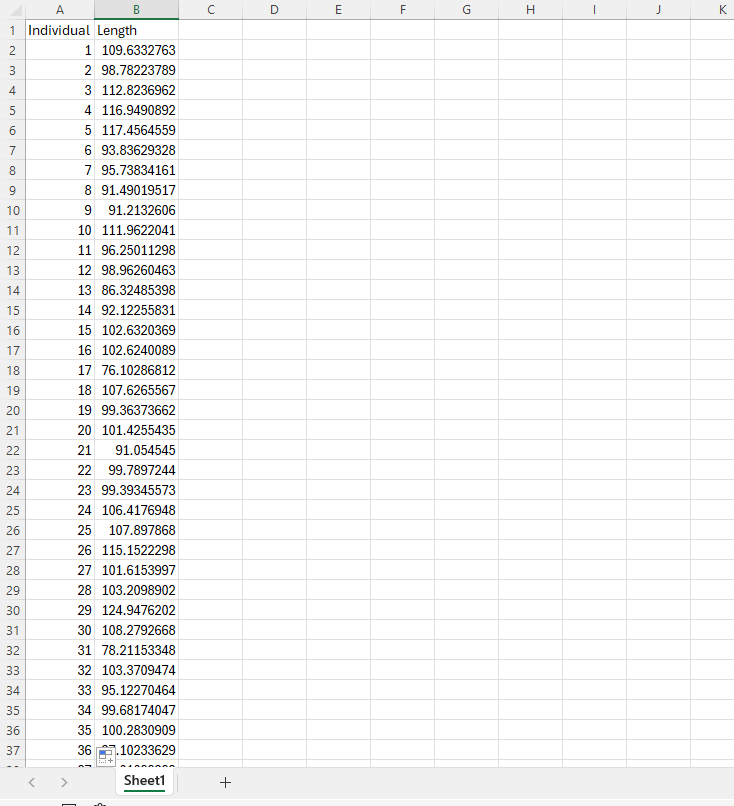
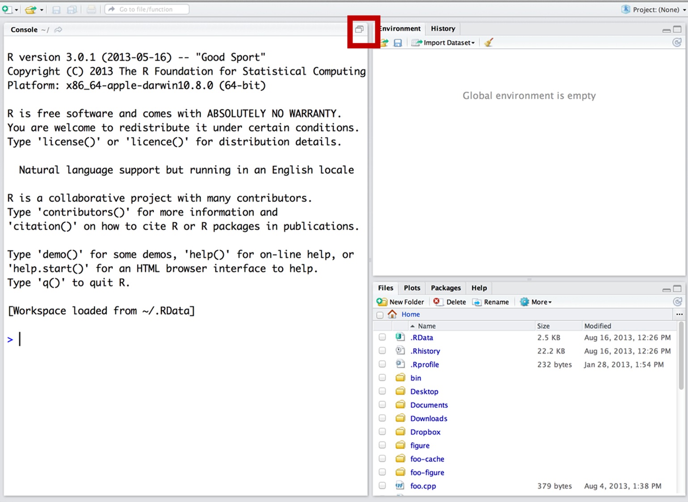
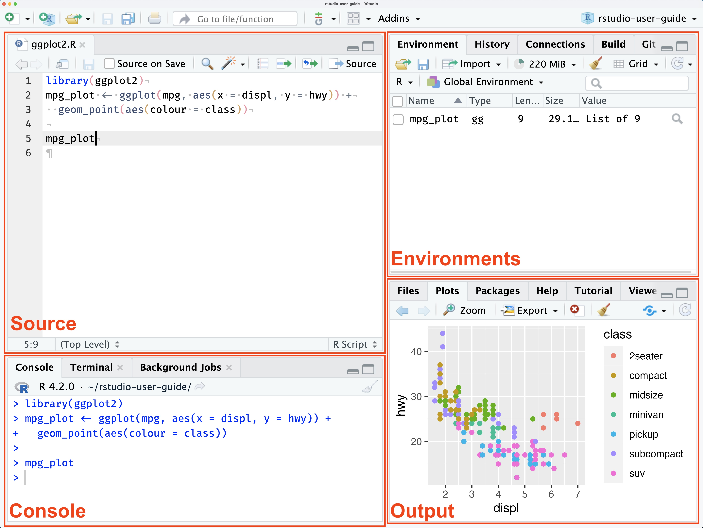

# Assignment 3.1

This has been already published to Canvas.

Read chapter 4.3, 4.4, and 4.5 and submit a comment.

Estimate the Standard Error by hand (you can use a calculator) from the systolic blood dataset. You have the standard deviation and the n, so it should be pretty straightforward! 

Also estimate the confidence interval

Upload this by end of day Monday.

# Assignment 3.2 (15 pts)

You will submit:

1\) Answers to the questions

2\) Your excel file with all formulas

2\) Your R code

Raise your hand if you have any questions.

# Section 3.2.1

Answer the following problems from the book (chapter 4):

2

3

8

9

13

26

# Part 3.2.2

## Random sampling

You are working in a small pond in New England. This pond has exactly 100 American eels (*Anguila rostrata)*. The mean total length of this population is 100-cm. We will be randomly sampling a small number (n=12) and estimating the mean of the population. We will also be estimating the standard error. In this case, we know the real population mean (100-cm) and thus, we can tell whether our mean estimate was close or not to the real population mean!

{width="428"}

We will be doing this pretty straightforward exercise in both Excel and program R.

On Canvas there should be 2 files. Download both of them. Use `eel.xlsx` for excel, and `eel.csv` for program R.

### Excel

When you download and open the file you should see the following:



This file contains the size of EVERY SINGLE INDIVIDUAL in the population (100 eels). We will be sampling 15 individuals at random.

Before we do that, you should make sure I am not lying to you and check whether the mean length is actually 100.

In cell B102 you can estimate the mean **population** length by typing:

```         
=AVERAGE(B2:B101)
```

If you get 100, you can continue, if you don't, figure out what's going on before continuing.

#### Let's sample!

Let's now assume we are out fishing and you catch 12 individuals (random sampling). Selecting a random sample in excel is annoying, but we will do it once. Moving forward, we will be using R.

In order to create a random sample, name column C "sample Length" and then we can sample our 12 individuals. Unfortunately, Excel does not have a great function for sampling without replacement... so, we need to add the **Data analysis add-in:**

In order to add data analysis go to File \> Options \> Add-Ins, then in the "Manage" dropdown, select "Excel Add-ins" and click "Go". In the available add-ins list, check the box next to "Data Analysis Add-in" and click "OK". If you absolutely cannot get this add-in, work with someone.

Now, with this data analysis add-in we can sample. Go to "Data", and on the Analyze section you should be able to see the Analysis Add-in. Click it and select "sampling".

For input range select ALL the lengths from the individuals (all 100). For number of samples select 12, and select C2:C13 as the output range.

#### Estimates

Next, estimate the mean of your sample using the `AVERAGE` function. Estimate the Standard Deviation using `STDEV.S` and a confidence interval using the rule of thumb (see powerpoint). Let me know whether

### Program R

When using RStudio, you should avoid writing code in the "console". Remember this screen?

Open R-Studio and go to file \> new script. If you only see three screens, make sure to press the button in the red square



and then you should look something like this:



Write all your code in the source section. Then you can run each line by pressing the `run` button or by hitting `ctrl` + `enter`.

You can import data of various formats into R; they include data tables in the form of `.dbf`, `.csv`, and `.xlsx` files or even spatial data such as vectors `.shp` or rasters `.nc`.

But the most common type of data files imported into R are probably`.csv` files.

You can import the dataset using the function `read.csv()`

Type this into R:

```{r }
eel<-read.csv('eel.csv')
```

The text within the brackets, and contained in quotation marks, is the file path (directory and file name) of the file you want to import. This is my directory. Yours would most likely be different. Perhaps something like…

If you want to look at the top five rows of your head you can use the following:

```{r}
head(eel)
```

We will do the same exact analysis we did in excel. First, we need to confirm the population mean:

```{r}
mean(eel$Length)
```

Then, let's sample 12 individuals using:

```{r}
sampled.eels<-sample(eel$Length,12)
```

Be aware than your sample will be different than your excel sample.

You need to estimate the mean using `mean`, the standard deviation using `sd`, and the confidence interval using the following equation:

$$
CI = mean \pm 2 \times std.err
$$

So, to estimate the mean use:

```{r eval=F}
std.dev<-mean(sampled.eels)
```

And to estimate the standard error you use:

$$
std.err = st.dev \div  \sqrt{n}
$$

And remember that n is 12.

Answer:

Did the confidence interval include the real mean of 100?

Upload the excel file and the R file . Make sure your R file has the steps to estimate the mean, standard deviation, and the confidence intervals.
