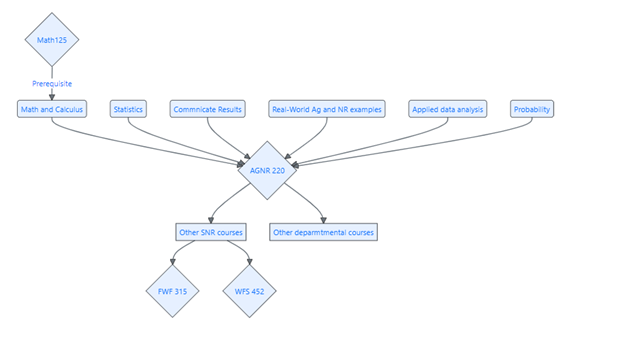

---
categories:
  - course-overview
  - statistics
  - agriculture
  - natural-resources
---

# Welcome! {.unnumbered}

### Introduction to Statistical Analysis in Agriculture and the Natural Resources

Welcome to **AGNR 220 / SNR 220 — Introduction to Statistical Analysis in Agriculture and the Natural Resources**! This companion book supports the Fall 2026 course taught by Dr. Alejandro Molina-Moctezuma at the University of Tennessee.

Every chapter in this book pairs directly with an in-class slideshow presentation. Think of the slideshows as the "live" portion of the lesson and this book as the place you come back to for deeper explanations, step-by-step examples, and a reference you can consult whenever you need it. **This book will be updated throughout the semester** — new chapters, examples, and figures will be added as we progress through the material.

::: {.callout-note}
## How to use this book

Each chapter corresponds to one week of class. Before each week, skim the **Learning Objectives** so you know what to focus on. After class, use the **How to Do It by Hand**, **How to Do It in Excel**, and **How to Do It in R** sections to practice what you learned. The **Practice Problems** at the end of each chapter are great preparation for assignments and exams.
:::

No prior statistics experience is required for this course — just basic arithmetic. We will build every concept from scratch using real examples from agriculture and natural resources.

## Syllabus

Please check Canvas for the most up-to-date syllabus, or see the **Syllabus** chapter in the left sidebar.

## Objectives and structure

**Specific Course Objectives**

This is an **applied** data analysis course targeted to students working in natural resources and agriculture. This course will focus on real-world problems and real-world data relevant to natural resources, animal science, plant science, and agriculture. All the applied problems we will work on are from the real world, and can be solved using real-world data. The ultimate **objective** is for students to be able to answer and solve data problems commonly found in the natural resources by analyzing data and inferring results. Some of the outcomes for students are to:

1.  identify data types and statistical methods,
2.  apply statistical techniques to a variety of natural resource management questions,
3.  identify and apply statistical methods commonly used to answer questions in agricultural resource analysis,
4.  communicate results of statistical analysis to stakeholders (e.g., users of natural and agricultural resources),
5.  apply statistical knowledge to decision making in natural resources and agriculture, and
6.  analyze data sets using Excel and a basic introduction to R.

**Course Structure**

This course is structured in five units. Each week covers one topic area and corresponds to one chapter in this book. During each week you will:

1.  **Learn:** Attend the lecture and follow along with the slideshow.
2.  **Practice:** Work through in-class examples collaboratively with your classmates.
3.  **Apply:** Tackle a real-world agricultural or natural resource scenario.
4.  **Read:** Use this book for background, step-by-step examples, and worked problems.
5.  **Submit:** Complete take-home assignments that reinforce the week's skills.

**Book Units**

| Unit | Topic Area | Weeks |
|------|-----------|-------|
| 1 | Getting Started with Data | 1–4 |
| 2 | Probability and Uncertainty | 5–7 |
| 3 | Inference and Hypothesis Testing | 8–11 |
| 4 | Comparing Groups | 12–14 |
| 5 | Relationships Between Variables | 15 |

## Citing this book

Please cite this book using:
